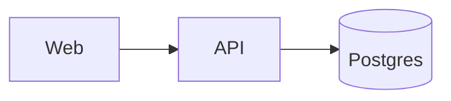

# Vizzy

Vizzy is a macOS app that renders diagrams from Markdown files so a team can *see* how
their system works — architecture maps, sequence flows, control-flow charts, schedules,
mind maps — that live in the repo right next to the code.

This skill teaches you to author and maintain those diagrams. **Explore the real code
first** — read the routes, the service classes, the config; trace a request — so the
diagram reflects what's actually there, not a guess. Then draw.

This file is the entry point and covers the essentials. Reach for a reference below when
you need depth on a specific area.

| For… | Read |
|------|------|
| The grammar of every diagram type (sequence, flowchart, architecture, class/ER/state, gantt, timeline, journey, pie, xychart, quadrant, treemap, diff, data table, git graph, mind/concept map) | [`references/diagram-types.md`](references/diagram-types.md) |
| Annotations & styling — the `vizzy`-fence directives (`desc`/`note`/`payload`/`style`/`hint`/`pos`/`phase`/`frame`/`title`/`tablewidths`/`cellstyle`/`layout`/`collapse`), Mermaid styling, conditional table color-coding, and `desc` vs `note` vs `hint` | [`references/annotations.md`](references/annotations.md) |
| The `vizzy` CLI — render to PNG, lint, and drive the live app window | [`references/cli.md`](references/cli.md) |
| Colors, theming with `vizzy.config`, and assets | [`references/theming.md`](references/theming.md) |

## Where diagrams live

A `*.vizzy.md` file can live anywhere — no folder name or git repo is required. The good
convention, though, is one `vizzy/` folder at the repo root, one concern per file:

```
vizzy/
  architecture.vizzy.md     # high-level service / component map
  <flow>.vizzy.md           # one file per important flow (auth, checkout, …)
  vizzy.config              # optional — re-theme the standard color palette
  assets/                   # optional — images / icons referenced by diagrams
```

Start with `architecture.vizzy.md`, then add a file per important runtime flow. **One
concern per file** — if you find yourself drawing two unrelated flows in one file, split
them.

## Set up `.gitignore`

Vizzy writes a `<name>.vizzy.comments.json` sidecar next to a diagram when review comments
are added to it — local review state, not part of the diagram. Add this line to the repo's
`.gitignore` (create the file if absent) so these are never committed:

```
*.vizzy.comments.json
```

## Frontmatter (every file)

Every `*.vizzy.md` begins with YAML frontmatter:

```yaml
---
title: Auth architecture     # optional
layout: LR                   # optional — TB (default, top→bottom) or LR (left→right)
created: 2026-06-16          # date the file was first authored
lastEdited: 2026-06-16       # bump to today's date on every edit
---
```

`created` and `lastEdited` are `YYYY-MM-DD` dates and should always be present. Set
`created` once; **bump `lastEdited` to today on every edit**. `title` and `layout` are
optional.

## `vizzy` fences vs `mermaid` fences

The body is plain GitHub-Flavored Markdown: prose renders as annotation cards, fenced code
blocks render as diagrams. There are two kinds of diagram fence:

- A ` ```mermaid ` fence holds standard Mermaid (a practical subset): `sequenceDiagram`,
  `flowchart`/`graph`, `classDiagram`, `erDiagram`, `stateDiagram-v2`, `gantt`, `timeline`,
  `journey`, `pie`, `xychart-beta`, `quadrantChart`, `treemap-beta`, `gitGraph`, `mindmap`,
  `conceptmap`. This is the diagram itself.
- A ` ```vizzy ` fence is Vizzy's own mini-language. It does two things Mermaid can't:
  1. a standalone `architecture` service map (services, groups, labelled edges); and
  2. annotations layered onto the diagram (or Markdown table) in the fence **immediately
     above** it — `note`, `desc`, `payload`, `style`, `hint`, `pos`, `phase`, `frame`,
     `title`, `tablewidths`, `cellstyle`, `layout`, `collapse`.
- A ` ```diff ` fence renders `git diff` output as a diff diagram — no special syntax, just
  paste it in (a `vizzy` fence below can add `layout split` / `collapse N`). See
  [`references/diagram-types.md`](references/diagram-types.md).

Rule of thumb: reach for a ` ```mermaid ` fence to draw the diagram; add a ` ```vizzy `
fence right after it only when you need an architecture map, or want to annotate, position,
or tint specific nodes.

Example — a Mermaid diagram annotated by a vizzy fence:

````


```vizzy
note api: rate limited 5/min
payload web->api: POST /login {email, pw}
```
````

A short prose paragraph above each diagram (explaining its intent) renders as an annotation
card and orients the reader — write one.

## Do a good job

- **Explore the real code first.** Diagram what's actually there.
- **Short, stable ids; readable labels.** Ids (`api`, `db`, `web`) are for referring to
  nodes in annotations and edges — keep them short and unlikely to change. Labels are what
  the reader sees.
- **On edges, show what is exchanged.** `POST /login {email, pw}` beats a bare arrow.
- **Pick the right diagram type** — see [`references/diagram-types.md`](references/diagram-types.md).
  Sequence for a request/response flow; architecture fence for the static service map;
  flowchart for branching logic; mind map for a brainstorm; concept map for a domain model.
- **Don't over-style.** A clean, unstyled diagram beats a decorated one. Only tint a node
  when it aids comprehension (a critical path, a deprecated component).
- **Keep diagrams accurate.** When the architecture changes in code, update the matching
  `vizzy/*.vizzy.md` and bump its `lastEdited` date.
- **Lint after authoring** — `vizzy lint <file>` catches mistakes the renderer silently
  swallows (see [`references/cli.md`](references/cli.md)), especially broken `hint` paths.
