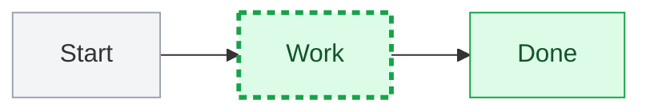

# Annotations & styling

A ` ```vizzy ` fence placed **directly after** a diagram annotates it: reference node /
edge / group ids declared in the diagram above. (A `vizzy` fence whose first word is
`architecture` is a standalone diagram instead — see [`diagram-types.md`](diagram-types.md).)

## Directives

| Directive | Effect |
|-----------|--------|
| `desc <id>: text` | A one-line description under a node's label or a group's title |
| `note <id>: text` | Attach a sticky note beside a node |
| `payload <A>-><B>: text` | Label what an edge carries |
| `style <id> fill:…,stroke:…` | Override a node's Mermaid style (layers on top) |
| `hint <id>: [Title](dest)` | Attach a click-to-open info hint badge (see below) |
| `pos <id> x=320 y=40` | Pin a node's position (its center) |
| `phase <label>: <A->B> [color:…] [desc:…]` | A sequence swimlane band starting at message `A->B` |
| `frame <keyword> [condition] color:<token>` | Tint a sequence combined fragment's tab / border / dividers |
| `title <text>` | Set the diagram's title (handy for a table, which has no title line of its own) |
| `layout TB` / `layout LR` | Override flow direction |

`desc` reads the same in an `architecture` fence (where ids may be declared further down)
and in an annotation fence after a Mermaid diagram. On a **group/subgraph** id it renders
as a subtitle under the section's title (the gray box grows to fit); on a **node** id it
renders as a small line under the label.

**Timeline & journey** support `desc`, `hint`, `style`, and `note` too, targeting a period
by its **time label** or a step by its **task label** (labels may contain spaces). `style`
tints the period's event cards / the step's score marker; `desc` adds a caption;
`note over <label>: …` drops a sticky note by that column:

```vizzy
desc 2004: Facebook launches
hint 2004: [Why it mattered]("opened to the public in 2006")
style 2004 fill:blue
note over 2004: the inflection point
```

### Sequence swimlanes (`phase`) and fragment tints (`frame`)

`phase` groups consecutive messages into a labeled, tinted horizontal band with the label
in a left gutter. Each phase anchors to its first message (`A->B`) and runs until the next
phase begins — so a repeated `A->B` advances to the next stage:

```vizzy
phase START:     Browser->Django   color:blue
phase BOOTSTRAP: Django->S3        color:indigo  desc: bg thread
phase MESSAGE:   Browser->Django   color:green
```

`frame` tints a combined fragment (see [`diagram-types.md`](diagram-types.md)), named by
its keyword + condition. Pair either with `style <id> fill:<color>` on the participant
heads for the full color-coded look:

```vizzy
frame loop every minute  color:blue
frame alt healthy        color:green
```

## Styling — standard Mermaid (inside a `mermaid` fence)

Vizzy parses **real Mermaid styling** — don't invent a syntax:



- `style <id> <props>` styles one node. `classDef <name> <props>` + `class <id1>,<id2>
  <name>` define and apply a reusable class; `classDef default` styles every node;
  `id:::name` is shorthand for `class`.
- Props use Mermaid names: `fill` = background, `stroke` = border, `color` = **text**,
  `stroke-width` (e.g. `2px`), `stroke-dasharray` (e.g. `5 4`, dashed).
- Merge order: `classDef default` < class / `:::` < inline `style` < a `vizzy`-fence override.
- `linkStyle <i,j,… | default> stroke:…,stroke-width:…,stroke-dasharray:…` styles edges by
  source order (theme-resolved); it colors the line and its arrow heads.

Mermaid styling only applies inside `flowchart` / `graph` fences. To tint a node in a
sequence, class, ER, or state diagram, use a `vizzy`-fence `style <id> …` override instead.

## Info hints

`hint` attaches a small badge to a node, edge, or group — an `(i)` for an inline note, or
an open-arrow when the destination is a file link. Hover shows a markdown preview (or
`Open: <title>` for a link); clicking opens a new window. The value is a **markdown link** —
a quoted destination is inline markdown, a path links a file (`.md` rendered as markdown,
`.vizzy.md` opened as a diagram):

```vizzy
hint api: [Rate limit]("Token bucket, **5 req/min**, refilled per second.")
hint api: [Runbook](../runbooks/rate-limiting.md)   # a .md file, rendered as markdown
hint api->db: [Schema](db.vizzy.md)                 # a .vizzy.md, opened as a diagram
```

The subject is a node id, a group id, or an edge written compactly as `A->B`. On a
**sequence diagram** the subject can also be a combined fragment, written as its
`<keyword> [condition]` — `hint loop up to 3 attempts: …`, `hint alt approved: …` — with
the badge at the fragment's top-right; repeated hints walk successive matching fragments.
Paths resolve relative to the document's folder. Two `hint`s on the same subject merge
(inline = preview, file = click target). Toggle all hints with the eye button in the toolbar.

## `desc` vs `note` vs `hint` — pick by what the words are about

- **`desc`** labels *what a thing is* — it becomes part of the node or section (a subtitle
  under the label, or under a group's title). Reach for it first when describing a box or a
  whole gray section: `desc store: Storage, services & external` on the section reads far
  better than pinning a yellow note to one member node inside it.
- **`note`** is a yellow card *beside* a node — a short aside or caveat worth seeing at a
  glance (`rate limited 5/min`, `deprecated — use v2`), not the thing's own description.
- **`hint`** tucks deeper detail behind an `(i)` badge that opens on hover/click and can be
  toggled off: the *why*, a longer explanation, or a link to another file or diagram.

Rule of thumb: describing the box or section → `desc`; a short always-visible aside →
`note`; skippable supporting detail → `hint`. Don't pin a yellow note to a member node to
describe its whole section (use `desc` on the group), and don't hide a one-word caveat
behind a hint nobody will click.
